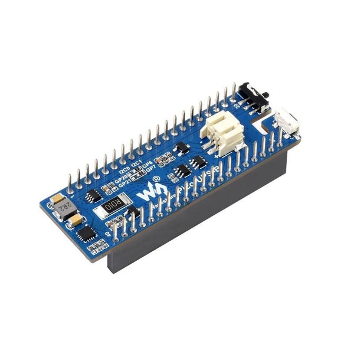

# race-plotter
Open-source hardware-based boat racing GPS plotter.


<figure>


<figcaption align = "left"><b>Fig. 1 - Mock-up of compass and shift indicator as if lifting on starboard tack</b></figcaption>

</figure>


## Background

Yacht racers benefit from knowing their speed and heading, and how it is changing with time. With increasing access to global navigation systems, electronic navigation aids have become available and are class legal to a greater or lesser degree.

The UK/RYA [class rules](https://assets.rya.org.uk/assetbank-rya-assets/action/directLinkImage?assetId=53776) for a closed class such as the Hunter 707 do not permit anything not specifically mentioned. However they do permit:

0. Electrical power only socket fitting for portable GPS unit.
0. Stand alone or portable GPS (not interfaced) which may be electrically fed from
the yacht’s battery
0. Self-contained electronic timing devices, and either an electronic digital
compass or an additional magnetic (non-electronic) compass

This rules out masthead wind strength and direction instruments, and cruiser-style GPS systems with wiring to separate chart plotters etc.  However, portable GPS typically contain a chartplotter and all manner of derived properties can be displayed. Since large-screen portable GPS units are fairly expensive, and fiddly to use, it's tempting to consider a more specialised instrument for yacht racing.


There are some excellent specialised electronic navigation aids available for racing. They can seem expensive compared to consumer gadgets, presumably due to the smaller production volumes, and ruggedisation to handle difficult conditions. Some gadgets I am aware of include the [speedpuck](https://www.velocitek.com/pages/speedpuck), [prostart](https://www.velocitek.com/pages/prostart), [sailracer](https://www.sailracer.net/inkdisplay/).

Given there are some stock availability issues with the speedpuck and sailracer display just now, it's attractive to consider developing an open-source hardware system. This has the benefit of allowing the freedom to play about with different ways of representing data during training, e.g. heading variation plotted with time, or chart plotter showing race track (with race committee, pin end buttons, and a potentiometer for distance to top mark, and another for bearing to top mark, as these are often read out over the radio prior to the start). Initially, a button-free device is intended because that is easier to waterproof, and one fewer thing to have a setting that can be wrong.

## Constraints

- Daylight
- Water
- Shocks

A flexible e-ink screen with fast refresh should handle daylight visibility and shocks. It remains to be seen how well an e-ink display refreshes in bright sunlight. Perhaps a UV filtering cover will be required.

Waterproofing will be most straightforward if an existing IP68 enclosure is purchased, perhaps with some 3D printed mounts for the internal components.

## Development hardware

The following items have been purchased for the development work

0. Raspberry Pi Pico £3.60
0. Waveshare 3.7" e-Paper e-Ink Display for Raspberry Pi Pico (480x280) £24.00
0. GNSS Module for Raspberry Pi Pico (L76B) £25.00
0. ML1220 rechargeable battery £3
0. Waveshare UPS Module for Raspberry Pi Pico £19.00
0. 10,000mAh 3.7V Lithium battery £20.99

The total cost so far is £95.59 (nearly a third of the way to the cost of a speedpuck, with no code, no testing, and no case!)





## Development notes

### Fonts

An updated version of Derek Higg's hand-traced mil spec aviation instrumentation [font](https://www.simpits.org/fileproc/dload.php?file=MS33558FONT.ZIP) is available here:
https://forums.eagle.ru/topic/266630-ms33558-font/


The digits in this font were prepared for the e-ink display in the size 189 high by 144 px wide using [font2bytes](https://github.com/ayoy/font2bytes) GUI version on linux/amd64 (remember to initialise and update submodules to get the gsl library files needed for the build).

### GNSS

There is no C code available from the waveshare wiki for this board. It uses a serial protocol, so the python code will be sufficient information on how to operate with the GNSS board.

The micropython [UART](https://docs.micropython.org/en/latest/library/machine.UART.html) is configured as 

``` 
def Uart_Set_Baudrate(self, Baudrate):
    self.ser = UART(0,baudrate=Baudrate,tx=Pin(0),rx=Pin(1))%
```
where 
```
class machine.UART(id, ...)

UART.init(baudrate=9600, bits=8, parity=None, stop=1, *, ...)
```

Therefore the 0 is just the UART identification. The serial link is configured as the default 9600baud 8 bits, no parity, 1 stop bit.

A char-by-char forward to printf yields the output from the GNSS chip on the rpi terminal display.

The GNSS board produces default output in the following (repeating) form:

```
<snip>
$GPGSV,4,1,13,27,82,129,29,08,59,283,18,10,48,118,41,23,42,068,42*7B
$GPGSV,4,2,13,16,38,176,24,21,28,238,21,07,20,290,21,36,19,140,38*7A
$GPGSV,4,3,13,30,17,317,17,18,14,062,34,15,11,031,20,13,07,003,*77
$GPGSV,4,4,13,26,06,165,*4B
$BDGSV,3,1,10,24,34,278,14,20,32,066,46,29,30,091,46,19,27,124,44*6B
$BDGSV,3,2,10,26,23,225,23,12,15,269,,13,13,047,36,25,12,333,34*65
$BDGSV,3,3,10,05,08,113,39,08,02,042,*61
$GNGLL,xxxx.xxxx,N,xxxxx.xxxx,W,210155.000,A,D*50
$GNRMC,210156.000,A,5555.9592,N,00310.4012,W,0.00,317.31,020222,,,D*63
$GNVTG,317.31,T,,M,0.00,N,0.00,K,D*21
$GNGGA,210156.000,5555.9592,N,00310.4012,W,2,15,0.69,50.7,M,49.6,M,,*52
$GPGSA,A,3,16,08,23,27,18,21,30,10,15,,,,1.03,0.69,0.76*09
$BDGSA,A,3,13,05,29,25,20,19,,,,,,,1.03,0.69,0.76*1E
<snip>
```

These messages can be interpreted as follows:

#### GPGSV GPS satellites in view

Information from [here](https://docs.novatel.com/OEM7/Content/Logs/GPGSV.htm)


```
$GPGSV,4,1,13,27,82,129,29,08,59,283,18,10,48,118,41,23,42,068,42*7B
$GPGSV,4,2,13,16,38,176,24,21,28,238,21,07,20,290,21,36,19,140,38*7A
$GPGSV,4,3,13,30,17,317,17,18,14,062,34,15,11,031,20,13,07,003,*77
$GPGSV,4,4,13,26,06,165,*4B
```

Field | Structure | Description
---|---|---
1  | $GPGSV | header 
2  | #msgs | total number of messages
3  | msg # | message number
4  | # sats | number of satellites
5  | prn   | satellite PRN number (GPS=1-32, Gallileo=1-36, BeiDou=1-63, etc)
6 | elev | elevation degrees, 90 max
7 | azimuth | degrees true, 000-359
8 | SNR | Signal to noise ratio
| | (repeat 5-8 for more satellites)
n | *xx | checksum

In this example there are 13 GPS satellites in view.


#### BDGSV Beidou Satellites in view

At first glance, this has a similar structure to GPGSV.

```
$BDGSV,3,1,10,24,34,278,14,20,32,066,46,29,30,091,46,19,27,124,44*6B
$BDGSV,3,2,10,26,23,225,23,12,15,269,,13,13,047,36,25,12,333,34*65
$BDGSV,3,3,10,05,08,113,39,08,02,042,*61
```

In this example, there are 10 Beidou satellites in view.

#### GNGLL Geopgraphic position and latitude

[description](https://docs.novatel.com/OEM7/Content/Logs/GPGLL.htm)


```
$GNGLL,xxxx.xxxx,N,xxxxx.xxxx,W,210155.000,A,D*50
```

Field | Structure | Description
---|---|---
1 | $GPGLL | header
2 | Latitude | DDmm.mm where DD deg, mm.mm min
3 | lat dir| N(orth) or S(outh)
4 | longitude | DDDmm.mm where DD deg, mm.mm min (may have more decimal places than just two)
5 | lon dir | (E)east or (W)est
6 | utc | fix taken at hh:mm:ss UTC 
7 | valid | A valid data (V invalid)
8 | mode ind | Positioning system mode indicator 
9 | *xx | checksum

Mode | Indicator
---|---
A | autonomous
D | differential
E | estimated (dead reckoning)
M | manual input
N | data not valid

I've redacted the coordinates, but putting them into Google gives an error of about 3m, assuming I've estimated the antenna position correctly.


#### GNRMC  GPS specific information (for multi GNSS solution)

[description](https://docs.novatel.com/OEM7/Content/Logs/GPRMC.htm)


```
$GNRMC,210156.000,A,xxxx.xxxx,N,xxxxx.xxxx,W,0.00,317.31,020222,,,D*63
```

Field | Structure | Description
---|---|---
1 | $GPRMC | GPRMC for GPS only, GNRMC for multiple systems combined
2 | utc | UTC of position
3 | pos status | status of position, A valid, V invalid
4 | lat | DDmm.mm
5 | lat dir | N or S
6 | lon | DDDmm.mm
7 | lon dir | E or W
8 | speed Kn | speed over ground, knots
9 | track true | track made good, degrees true
10 | date | date dd/mm/yy
11 | mag var | actual magnetic variation, always positive
12 | var dir | direction of magnetic variation E/W 
13 | mode ind | position mode indicator (see table in GPGLL)
14 | *xx | checksum


For magnetic variation: E subtract var from true course, W add var to true course

#### GNVTG Track made good and ground speed (for multi GNSS solution)

[description](https://docs.novatel.com/OEM7/Content/Logs/GPVTG.htm)

If only GPS is used, then the header is GPVTG

```
$GNVTG,317.31,T,,M,0.00,N,0.00,K,D*21
```

Field | Structure | Description
---|---|---
1 | $GNVTG | GPVTG for GPS only, GNVTG for multi GNSS solution
2 | track true | track made good, degrees true
3 | T | true track indicator
4 | track mag | track made good magnetic
5 | M | magnetic track indicator
6 | speed Kn | speed over ground, knots
7 | N | nautical speed indicator
8 | speed km | speed km/h
9 | K | speed indicator (K=km/h)
11 | mode ind | position mode indicator (see table in GPGLL)
12 | *xx | checksum

Note that track mag = Track True + MAGVAR correction

## GNGGA GPS fix data and undulation (multi GNSS solution)

[description](https://docs.novatel.com/OEM7/Content/Logs/GPGGA.htm)

```
$GNGGA,210156.000,5555.9592,N,00310.4012,W,2,15,0.69,50.7,M,49.6,M,,*52
```
Field | Structure | Description
---|---|---
1 | $GPRMC | GPRMC for GPS only, GNRMC for multiple systems combined
2 | utc | UTC of position
3 | lat | DDmm.mm
4 | lat dir | N or S
5 | lon | DDDmm.mm
6 | lon dir | E or W
7 | quality|  (see table)
8 | # sats | number of satellites in use, may differ from number in view
9 | hdop | horizontal dilution of position
10 | alt | antenna altitude above/below mean sea level 
11 | a-units | units of altitude (M = metres)
12 | undulation | relationship between the geoid (mean sea level) and the WGS84 ellipsoid
13 | u-units | units of undulation (M = metres)
14 | age | age of correction data in seconds (max age is 99sec)
15 | stn ID | differential base station ID (empty when no differential data is present)
16 | *xx | checksum

##### Quality

Indicator | Description
---|---
0 | fix not available or invalid
1 | single point or converging PPP (TerraStar-L)
2 | single range differential, converged PPP (TerraStar-L) or converging PPP (TerraStar-C/C-Pro/X)
3 | (indicator not defined)
4 | TRK fixed ambiguity solution
5 | RTK floating ambiguity solution (converged PPP for TerraStar-C/C-Pro/X)
6 | Dead reckoning mode
7 | Manual input mode (fixed position)
8 | simulator mode
9 | WASS (SBAS) - placeholder


##### Dilution of Position (DOP)

DOP is lower for more accurate results, obtained when satellites are farther apart in the sky or there are fewer obstructions.

Table reproduced from [this Wikipedia article](https://en.wikipedia.org/wiki/Dilution_of_precision_&#40;navigation&#41;)

DOP value | rating | Description
---|---|---
<1 | Ideal | Highest possible confidence level to be used for applications demanding the highest possible precision at all times.
1-2| Excellent | At this confidence level, positional measurements are considered accurate enough to meet all but the most sensitive applications.
2-5 | Good | Represents a level that marks the minimum appropriate for making accurate decisions. Positional measurements could be used to make reliable in-route navigation suggestions to the user.
5-10 | Moderate | Positional measurements could be used for calculations, but the fix quality could still be improved. A more open view of the sky is recommended.
10-20 | Fair | Represents a low confidence level. Positional measurements should be discarded or used only to indicate a very rough estimate of the current location.
>20 | Poor | At this level, measurements are inaccurate by as much as 300 meters with a 6-meter accurate device (50 DOP × 6 meters) and should be discarded.

DOP is the combined effect of HDOP and VDOP.

##### Undulation

Older GPS receivers incorrectly gave MSL because it was not known just how big was the difference between the ideal ellipsoid model of the earth, and the actual surface.

MSL in newer receivers should have done the corrections already, although the [history](https://www.esri.com/news/arcuser/0703/geoid1of3.html) of this interesting.

### GPGSA GPS DOP and active satellites
 
[description](https://docs.novatel.com/OEM7/Content/Logs/GPGSA.htm)

```
$GPGSA,A,3,16,08,23,27,18,21,30,10,15,,,,1.03,0.69,0.76*09
```

$GNGSA if combined GNSS solution

Field | Structure | Description
---|---|---
1 | $GPGSA | GPGAS for GPS only, GNGSA for multi-GNSS solution
2 | mode | A automatic 2d/3d, manual (forced to operate in 2D or 3D)
3 | mode 123 | mode: 1 = fix not available, 2 = 2D, 3 = 3D
4 - 15 | prn | PRN numbers of satellites involved in the fix (null for unused, total of 12 fields)
16 | pdop | position dilution of precision
17 | hdop | horizontal dilution of precision
18 | vdop | vertical diluation of precision
19 | system ID | GNSS system id (NMEA version 4.11 only)
20  *xx | checksum

PRN: GPS 1 - 32, SBAS 33-64 (add 87 for PRN number), GLO 65- 96

DOP is the combined effect of HDOP and VDOP.
Note that as you'd expect from the example above: (0.76^2 + 0.69^2)^0.5 = 1.03 (2.d.p) 

### BDGSA Beidou DOP and active satellites

As above

```
$BDGSA,A,3,13,05,29,25,20,19,,,,,,,1.03,0.69,0.76*1E
```


### Matters arising in checking message formats

TODO - check whether system will always produce GN* messages, or do we need to ensure we are robust to getting both GN* vs GP* versions of messages (if only GPS or other satellites are used). Obviously, a more general system will support getting the information from both types of message.

CAN't DO: can we use altitude in GPGGA to estimate tide/wave height? No, the altitude is too inaccurate (in testing have noticed >5m jumps for stationary antenna and variations over 40m, which is bigger than the effect of waves/tide)

TODO Flash a warning sign / cease plotting when HDOP becomes too poor (i.e. too high)

### Parsing

Parsing strings in C can be less fun than in other languages ... so it makes sense to find a parser that is already tested. There are several, of which LwGPS seems most promising.

#### jacketizer/libnmea

Parses into structs - does it support GN versions? An issue about hardcoded paths. Another issue about skipping hdop.Is it lightweight enough for pico? 180 stars, 72 forks.

[github](https://github.com/jacketizer/libnmea)

#### craigpeacock/NMEA-GPS

Relies on strict ordering of fields in sentences. Lightweight

[github](https://github.com/craigpeacock/NMEA-GPS)

 
#### LwGPS

Platform independent ANSI C99, lightweight, intended for embedded systems. 213 stars, 95 forks. All issues closed.

Supports:

GPGGA or GNGGA: GPS fix data
GPGSA or GNGSA: GPS active satellites and dillusion of position
GPGSV or GNGSV: List of satellites in view zone
GPRMC or GNRMC: Recommended minimum specific GPS/Transit data

[docs](https://docs.majerle.eu/projects/lwgps/en/latest/)
[github](https://github.com/MaJerle/lwgps)


### Performance

The quality of the GPS signal is reported as Excellent (DOP_H = 0.78) when the antenna is in the window. 

```
[A/0.780000] 00:53:54 UTC @(xx.xxxx,xx.xxxx) z=xxxxm s=0.000000Kn c=257.010000°
```

It falls to Good when taken a few metres inside the house, with spurious non-zero speed readings while the antenna is stationary.
```
[A/2.590000] 00:53:45 UTC @(xx.xxxx,xx.xxx) z=xxxm s=1.050000Kn c=52.340000°
```
Covering the antenna completely with hands causes position quality to drop to Fair, or even invalid 

```
[V/0.000000] 00:56:49 UTC @(0.000000,0.000000) z=0.000000m s=0.210000Kn c=150.910000°
[A/15.330000] 00:56:50 UTC @(55.932733,-3.172743) z=50.500000m s=2.600000Kn c=91.260000°
[A/15.350000] 00:56:51 UTC @(55.932738,-3.172763) z=50.500000m s=2.610000Kn c=73.470000°
[V/99.990000] 00:56:52 UTC @(55.932752,-3.172750) z=50.500000m s=2.730000Kn c=64.440000°
[V/0.000000] 00:56:53 UTC @(0.000000,0.000000) z=0.000000m s=1.690000Kn c=77.000000°
```

## Display design

With a small 3.7in display mounted some 12 ft from the helm, only one numerical display is possible. For the case where a boat already has a compass and a paddle wheel for speed, then a useful display would be speed over ground, and relative shift in course over ground. This would help infer tidal flow and leeway (assuming there is crew available to cross-reference three instruments). A visually simple style would reduce cognitive loading / speed up reading the instrument. Devices such as the speedpuck have to use separate elements to make graphic indicators, because of the limitations of LCD technology. No such limitations apply to the e-paper so we are free to adopt continuous line styles with rounded ends that mirror the aviation instrumentation font. It is unavoidable that the decimal place is off centre. Therefore the shift indicator has to be on the top side to avoid two circles near other, but not vertically aligned. The spacing of the digits may be controlled by writing each of them separately as individual characters. 

 


### Refresh strategy

The main difference between partial and full refresh is that the screen is not cycled to grey/black and back for 3s. Usually a subset of the screen is written, with the X_start being a multiple of 8. If we want to do lots of smaller updates, then the individual regions could be separated into non-overlapping rectangles like this:


This would allow the individual components to have their own renderers. Except that the shift bar crosses three different buffers.

TL;DR. The screen can only do 2sec updates if writing the whole buffer, or 3sec if also using printf. Hence, benefit to using partial refresh, and selectively overwriting only those parts that have changed. This may become a limitation of compass mode where all three digits can change e.g. going from 099 to 100. Perhaps the bar writing routine will have to figure out how to "patch" the bar. 


## Parts - Original options considered

### GPS data on speed and heading

It's [reported](https://www.u-blox.com/en/press-releases/u-blox-and-velocitek-chosen-several-world%E2%80%99s-top-sailing-teams) that the velocitek SC1 uses ublox GPS, and [speculated](https://portal.u-blox.com/s/question/0D52p00008HKDqaCAH/stolen-device-velocitek-speedpuck-possible-to-locatetrack-the-ublox-antaris-lea4a-chip) that the speedpuck uses the LEA-4A, or [alternatively](https://www.gps-speedsurfing.com/default.aspx?mnu=forum&forum=6&val=100929) LEA-5M.

[GPS with RTC](https://thepihut.com/products/raspberry-pi-gps-hat) £45

[External antenna](https://thepihut.com/products/gps-antenna-external-active-antenna-3-5v-28db-5-meter-sma) £16

### Display
Custom LCD displays are used to get the large numbers and custom heading shift graphics. E-ink is used in the sailracer display. Fast-refresh e-ink could be a useful solution, subject to some concerns around fading during refresh in direct sunlight. 

[A flexible, fast 10" display](https://shop.sb-components.co.uk/products/10-3inch-1872x1404-resolution-flexible-e-ink-display-hat-for-raspberry-pi) for £210

### Case
[IP68 polycarb](https://uk.rs-online.com/web/p/general-purpose-enclosures/7739657) to fit the above display £48
[wall mount](https://uk.rs-online.com/web/p/enclosure-mounting-brackets/7739682) £6
### Raspberry pi 4
[RPI](https://thepihut.com/products/raspberry-pi-4-model-b) 2GB in stock £44

### RPI UPS Hat for charging/lithium battery operation
[UPS](https://thepihut.com/products/raspberry-pi-ups-hat) £16

### Battery 
[10Ah 3,7V](https://amazon.co.uk/Seamuing-Rechargeable-Integrated-Protective-Insulation/dp/B0953L98RK) for £21

### Costing
```
 45 GPS
 16 Antenna
210 Display
 48 Case
  6 Wall mount
 44 Pi
 16 UPS
 21 Battery
-----------
404 Total
```

Plus development work.

## Aspects to consider
Do all of the pi-hats stack?
Would need to 3D print a tray to hold the display in the front window of the case, and mounting tray for the components behind it, including antenna mount on top side.
Making waterproof charging port, or open up each time?
Add buttons to box for controls or do via bluetooth/wifi?

## Alternatives for similar or less expense:

### Inkplate
An alternative approach for less expensive hardware would be to use the original 6" inkplate, which for £99 comes with ESP32 microcontroller, and GPIO pins to which a GPS could be connected. As a glass-plate display it would be more likely to get broken, unless some shock absorbing mounts were used inside the waterproof enclosure.

### Rugged tablet
[mantis](mantistech.co.uk/RhinoTAB) has a 10000mAh battery and an IP68 tablet.

RaceQs does not show track during race.
Sail Racer has received some varied feedback on how well it works
https://tactiqs.io/ is for iOs.

So .... options to consider!


